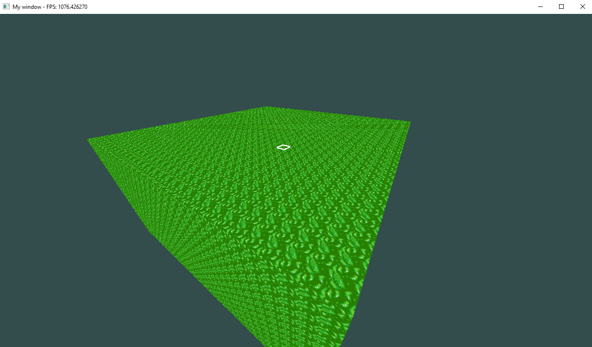
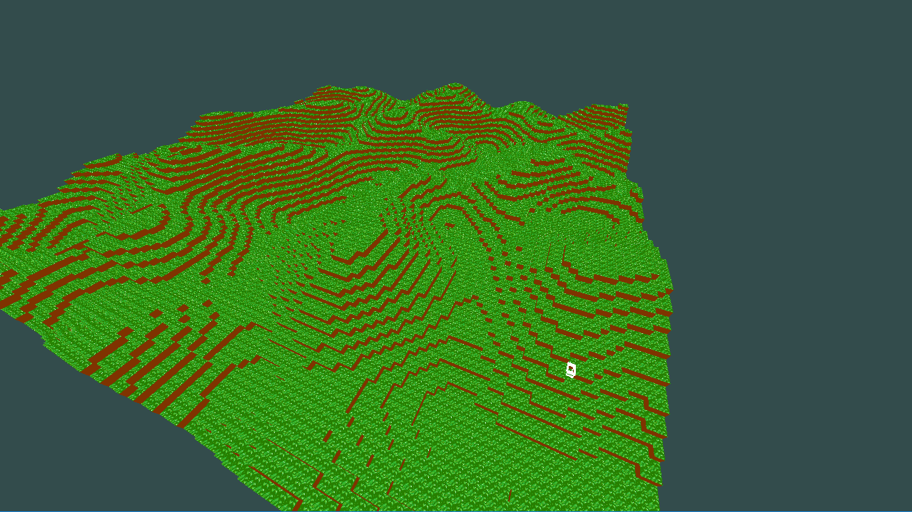
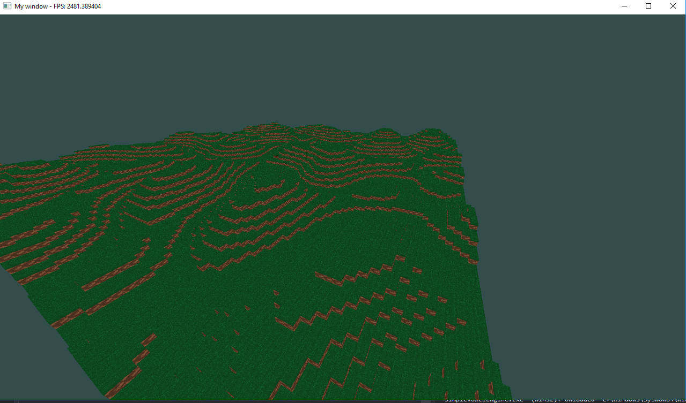

# Woxel
A voxel like game made whilst learning opengl

- Libraries used: SFML / GLM / GLAD

## Screenshots

### Add chunk generation

### Added a chunk manager so now we have 4x1x4 chunks

### Added perlinNoise and texture atlases

### Added backface culling and better textures

